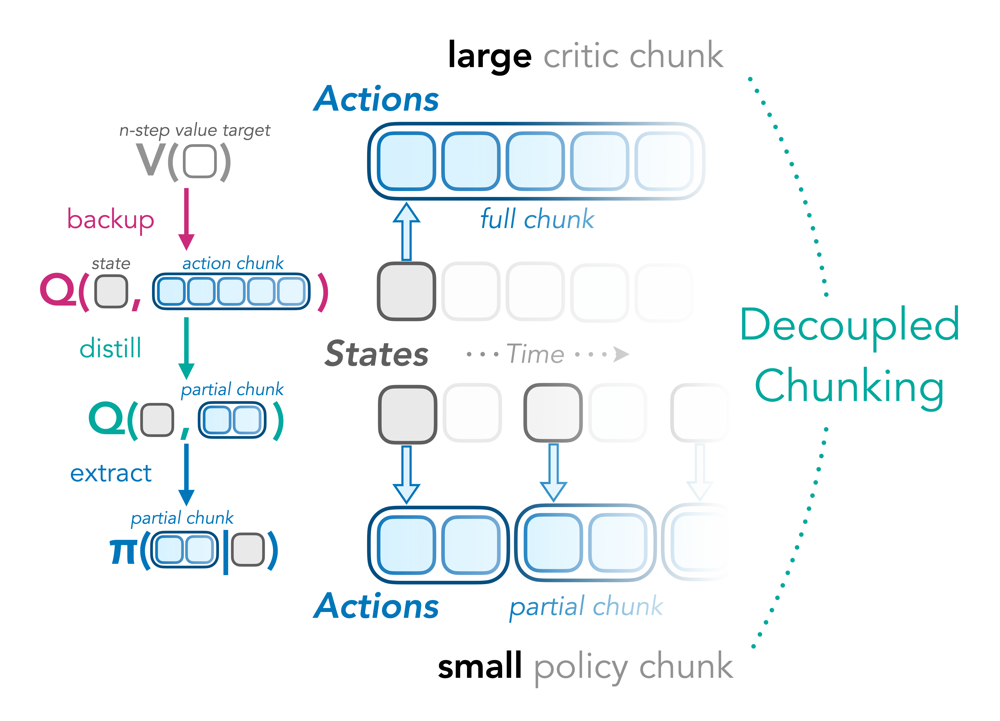

&nbsp;
<div id="user-content-toc" style="margin-bottom: 40px;margin-top: 60px">
  <ul align="center" style="list-style: none;">
    <summary>
      <picture>
        <source media="(prefers-color-scheme: light)" srcset="./assets/title.svg">
        <source media="(prefers-color-scheme: dark)" srcset="./assets/title-dark.svg">
        
      </picture>
      <br>
      <h2>[<a href="https://arxiv.org/pdf/2512.10926">Paper</a>] &emsp;|&emsp; [<a href="https://colinqiyangli.github.io/dqc">Website</a>]</h2>
    </summary>
  </ul>
</div>

<p align="center">
  <picture>
    <source media="(prefers-color-scheme: light)" srcset="./assets/teaser-tran-grad-min.png">
    <source media="(prefers-color-scheme: dark)" srcset="./assets/teaser-dark-tran-grad-min.png">
    
  </picture>
  <picture>
    <source media="(prefers-color-scheme: light)" srcset="./assets/dqc-bar-tran.png">
    <source media="(prefers-color-scheme: dark)" srcset="./assets/dqc-bar-dark-tran.png">
    
  </picture>
</p>

## Overview
Decoupled Q-chunking improves upon [Q-chunking](https://github.com/ColinQiyangLi/qc) by decoupling the chunk size of the policy from that of the critic. Policies with short chunk sizes are easier to learn and critics with long chunk sizes can speedup value learning.

Installation: `pip install -r requirements.txt`

For `humanoidmaze-giant` or `puzzle-4x5`, please set `--dataset_dir=None`. For `cube-quadruple` or `cube-triple` set `--dataset_dir=[DATA_ROOT]/...-100m-v0`. For `puzzle-4x6` or `cube-octuple` set `--dataset_dir=[DATA_ROOT]/...-1b-v0`.


## Reproducing paper results

We include the example command below for `cube-quadruple`. We also release our experiment data at [exp_data/README.md](exp_data/README.md) and include some scripts to generate the commands for all our experiments (`experiments/reproduce.py` for main results and `experiments/reproduce-sensitivity.py` for hyperparameter sensitivity results). We hope this helps facilitate/speedup future research!

```bash
# DQC
MUJOCO_GL=egl python main.py --run_group=dqc-reproduce --offline_steps=1000000 --eval_interval=250000 --seed=100001 --agent=agents/dqc.py --agent.num_qs=2 --agent.policy_chunk_size=5 --agent.backup_horizon=25 --agent.use_chunk_critic=True --agent.distill_method=expectile --agent.implicit_backup_type=quantile --env_name=cube-quadruple-play-oraclerep-v0 --agent.q_agg=min --dataset_dir=[DATA_ROOT]/cube-quadruple-play-100m-v0 --agent.kappa_b=0.93 --agent.kappa_d=0.8 --tags="DQC,h=25,ha=5"

# QC
MUJOCO_GL=egl python main.py --run_group=dqc-reproduce --offline_steps=1000000 --eval_interval=250000 --seed=100001 --agent=agents/dqc.py --agent.num_qs=2 --agent.policy_chunk_size=5 --agent.backup_horizon=5 --agent.use_chunk_critic=False --agent.distill_method=expectile --agent.implicit_backup_type=quantile --env_name=cube-quadruple-play-oraclerep-v0 --agent.q_agg=min --dataset_dir=[DATA_ROOT]/cube-quadruple-play-100m-v0 --agent.kappa_b=0.93 --tags="QC,h=5"

# NS
MUJOCO_GL=egl python main.py --run_group=dqc-reproduce --offline_steps=1000000 --eval_interval=250000 --seed=100001 --agent=agents/dqc.py --agent.num_qs=2 --agent.policy_chunk_size=1 --agent.backup_horizon=25 --agent.use_chunk_critic=False --agent.distill_method=expectile --agent.implicit_backup_type=quantile --env_name=cube-quadruple-play-oraclerep-v0 --agent.q_agg=min --dataset_dir=[DATA_ROOT]/cube-quadruple-play-100m-v0 --agent.kappa_b=0.5 --tags="NS,n=25"

# OS
MUJOCO_GL=egl python main.py --run_group=dqc-reproduce --offline_steps=1000000 --eval_interval=250000 --seed=100001 --agent=agents/dqc.py --agent.num_qs=2 --agent.policy_chunk_size=1 --agent.backup_horizon=1 --agent.use_chunk_critic=False --agent.distill_method=expectile --agent.implicit_backup_type=quantile --env_name=cube-quadruple-play-oraclerep-v0 --agent.q_agg=min --dataset_dir=[DATA_ROOT]/cube-quadruple-play-100m-v0 --agent.kappa_b=0.7 --tags=OS
```

## How do I obtain the 100M, 1B datasets?
Please follow the instructions [here](https://github.com/seohongpark/horizon-reduction?tab=readme-ov-file#using-large-datasets) to obtain the large datasets.

## Acknowledgments
This codebase is built on top of https://github.com/seohongpark/horizon-reduction.

## BibTeX
```
@article{li2025dqc,
  author = {Qiyang Li and Seohong Park and Sergey Levine},
  title  = {Decoupled Q-chunking},
  conference = {arXiv Pre-print},
  year = {2025},
  url = {http://arxiv.org/abs/2512.10926},
}
```
